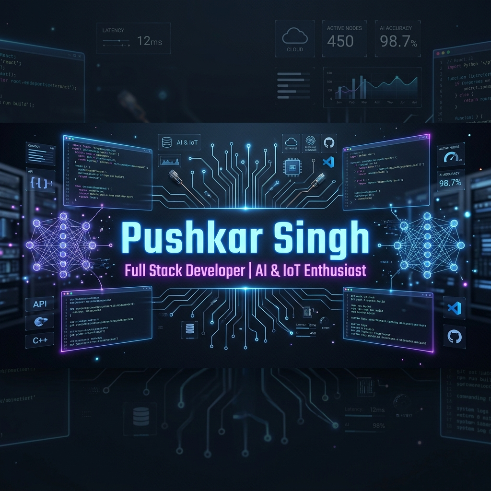
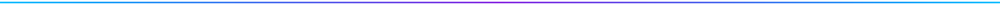

  
  <!-- Animated Header -->
  <h1>👋 Hi, I'm Pushkar Singh</h1>
  
  
   

  <!-- Visitor Counter -->
  

    

  <!-- Hero Banner -->
  

 

 

## 🔭 About Me

<table border="0">
  <tr>
    <td width="50%" valign="top">
      <h3>🚀 Current Focus</h3>
      <ul>
        <li>🔭 <b>I'm currently working on</b> lifefundies — a consultancy platform built with Next.js, Firebase & Framer Motion. Also working on a smart task management web app with smooth animations and responsive design.</li>
        <li>🌱 <b>I'm currently learning</b> Advanced Firebase, Framer Motion animations, ML integrations, and building production-ready full-stack applications.</li>
      </ul>
    </td>
    <td width="50%" valign="top">
      <h3>🤝 Collaboration & Learning</h3>
      <ul>
        <li>🤝 <b>I'm looking to collaborate on</b> Full-stack web apps, IoT systems, or anything at the intersection of AI and real-world impact. Especially open to startup ideas and student-led projects.</li>
        <li>🫶 <b>I'm looking for help with</b> Scaling Next.js apps, Firebase architecture, and exploring real-time features like live sessions via Daily.co.</li>
      </ul>
    </td>
  </tr>
  <tr>
    <td width="50%" valign="top">
      <h3>💬 Let's Talk</h3>
      <ul>
        <li>💬 <b>Ask me about</b> IoT systems (ESP32 & Arduino), React & Next.js, or how I built Focus Aura — an AI-powered attention monitoring system with a filed patent!</li>
      </ul>
    </td>
    <td width="50%" valign="top">
      <h3>⚡ Fun Fact</h3>
      <ul>
        <li>⚡ <b>Fun fact</b> My CubeSat collision detection system ranked Top 5 out of 900+ teams globally — built it as a 1st year CSE student.</li>
      </ul>
    </td>
  </tr>
</table>

 

 

## 💻 Tech Stack

  

  
   

  

    
  

 

 

## 🚀 Featured Projects

<table border="0">
  <tr>
    <td width="50%" valign="top">
      

        <h3>🔍 Focus Aura</h3>
        
<i>AI-powered attention monitoring system with a filed patent!</i>

        

          
          
        

      

    </td>
    <td width="50%" valign="top">
      

        <h3>💼 lifefundies</h3>
        
<i>A consultancy platform built with Next.js, Firebase & Framer Motion.</i>

        

          
          
          
        

      

    </td>
  </tr>
  <tr>
    <td width="50%" valign="top">
      

        <h3>🛰️ CubeSat Collision Detection</h3>
        
<i>Collision detection system ranked Top 5 out of 900+ teams globally. Built as a 1st year CSE student.</i>

        

          
          
        

      

    </td>
    <td width="50%" valign="top">
      

        <h3>📝 Smart Task Manager</h3>
        
<i>A smart task management web app with smooth animations and responsive design.</i>

        

          
          
        

      

    </td>
  </tr>
</table>

 

 

## 📊 GitHub Statistics

  
  <table border="0">
    <tr>
      <td valign="top" width="50%">
        
      </td>
      <td valign="top" width="50%">
        
      </td>
    </tr>
  </table>
  
   
  
  <table border="0">
    <tr>
      <td valign="top" width="50%">
        
      </td>
      <td valign="top" width="50%">
        
      </td>
    </tr>
  </table>

   

  

    

  <h4>🏆 GitHub Trophies</h4>
  

    

  <h4>✍️ Random Dev Quote</h4>
  

 

 

## 🐍 Contribution Snake

  <picture>
    <source media="(prefers-color-scheme: dark)" srcset="https://raw.githubusercontent.com/PushkarSingh1204/PushkarSingh1204/output/github-contribution-grid-snake-dark.svg">
    <source media="(prefers-color-scheme: light)" srcset="https://raw.githubusercontent.com/PushkarSingh1204/PushkarSingh1204/output/github-contribution-grid-snake.svg">
    
  </picture>

 

 

## 🔗 Connect With Me

  
  
  
  
  

